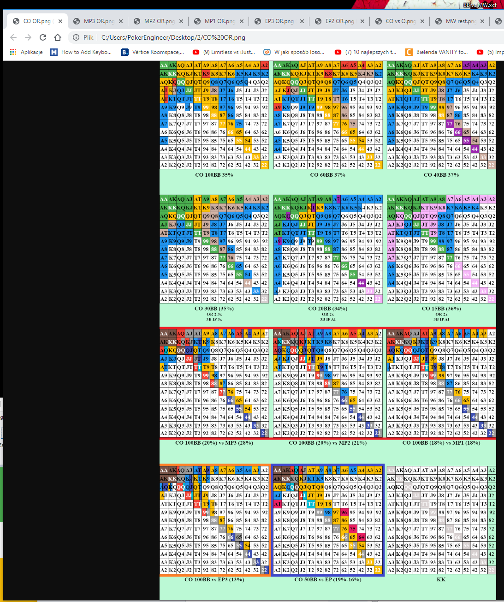

# Knockout_PL 1.0


# Local development

Run `index.html` in your browser: 

```html
index.js
```

it should show you a page with default 1st tab open.

## Extending tool

Below is description on how to add a new page, in our example it will be a page with ID `4`:

1. First you need to add an image (`image_4jpg`) to:

```html
./stronyJPG/image_4.jpg
```

2. Next add following button code ` <button class="tablinks 4" onclick="openTab(event, '4')">4</button>` - keep in mind u need to use 3 times ID `4` - under:

```html
./index.html

    ...

    <div class="tab">
        <button id="defaultOpen" class="tablinks 1" onclick="openTab(event, '1')">1</button>
        <button class="tablinks 2" onclick="openTab(event, '2')">2</button>
        <button class="tablinks 3" onclick="openTab(event, '3')">3</button>

        <button class="tablinks 4" onclick="openTab(event, '4')">4</button>
    </div>
```

3. Following step is to add a page tab itself, using your new page ID - `4` and pointing internal image to one from STEP#1 `<p></p>`:

```html
./index.html

    ...

    <!-- Tab content -->
    <div id="1" class="tabcontent">
        <p></p>
    </div>

    <div id="2" class="tabcontent">
        <p></p>
    </div>

    <div id="3" class="tabcontent">
        <p></p>
    </div>

    <div id="4" class="tabcontent">
        <p></p>
    </div>
```

4. The final STEP is assigning a new moustrap shortcut `alt+r` (you can use `ctrl` or any other SUPPORTED KEYS from a lib - <https://craig.is/killing/mice> ) with `openTab(event, '4');` call pointing to your new ID page:

```html
./index.html

    ...

    <script>
        $(document).ready(function() {
            // open default 1st Tab
            $("#defaultOpen").click();

            // combinations
            Mousetrap.bind('alt+q', function (e) {
                openTab(e, '1');
                return false;
            });
            Mousetrap.bind('alt+w', function (e) {
                openTab(e, '2');
                return false;
            });  
            Mousetrap.bind('alt+e', function (e) {
                openTab(e, '3');
                return false;
            });

            Mousetrap.bind('alt+r', function (e) {
                openTab(e, '4');
                return false;
            });
        });

    </script>
```

Thats it Knocki! :D

--
Hint for images: if u want images with orginal width (default id full width of the screen) just comment out lines 310-313 in `./css/styles.css`:

```css
./css/styles.css

.tabcontent img {
    width: 100%;
    margin: auto;
}

```


> Good luck!